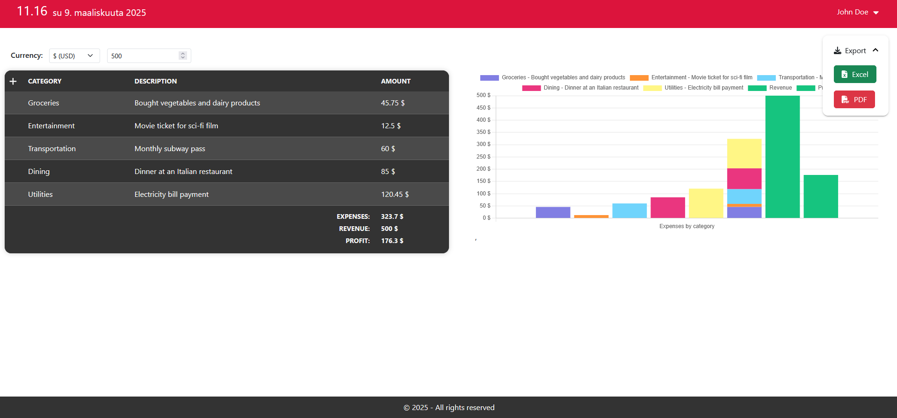
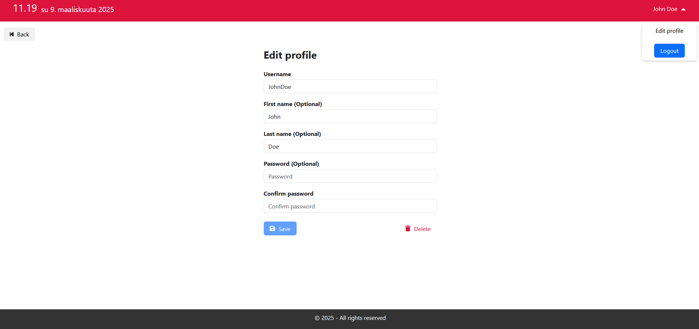
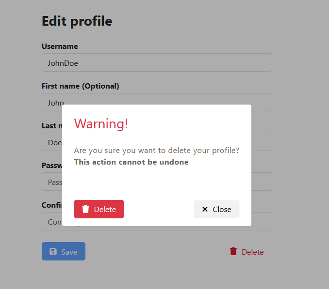
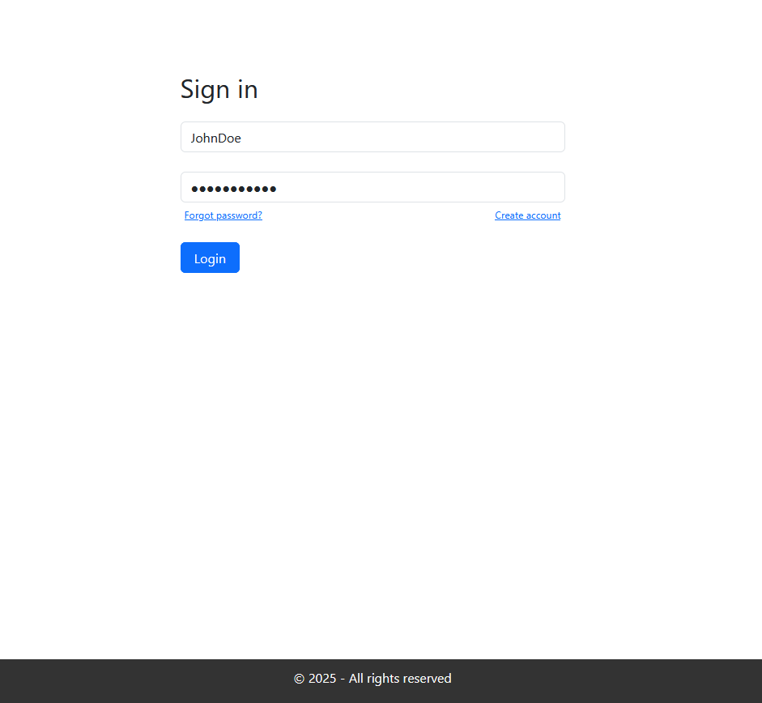

# Simple Expense Tracker

## Overview

Simple Expense Tracker is a Single Page Application (SPA) built using Angular for the front-end and ASP.NET Web API for the back-end. The app allows users to manage their personal finances by tracking their expenses in a simple, spreadsheet-like interface. It also provides visualizations of expenses through a bar chart.

### Key Features:

 * Expense Planning: Users can input their planned expenses in a spreadsheet-like layout.
 * Expense Visualization: Expenses are visualized using an interactive bar chart based on user input.
 * User Authentication: Implements secure authentication using JWT (JSON Web Token) and HttpOnly cookies.
 * Account Management: Users can log in, create a new account, modify existing account details, or delete their account.

### Technologies Used
 * Front-End: Angular
 * Back-End: ASP.NET Web API
 * Authentication: JWT with HttpOnly cookies
 * Charting: Chart.js library
 * Database: SQLite (In-memory database)

## Features

### Expense Management:

  Users can plan their expenses by adding data in a spreadsheet-like table.
  Input categories such as category, description and amount for each expense.
  The entered expenses are visualized.

### Visualizations:

  A bar chart is generated to visualize the expenses.
  The chart dynamically updates as the user enters new data.

### User Authentication:

  Login: Users can log in using their credentials.
  Registration: Users can create a new account.
  Account Modification: Users can modify their account details.
  Account Deletion: Users can delete their account.

### Security:

  JWT tokens are used to authenticate users.
  HttpOnly cookies store JWT tokens for secure session management, preventing XSS attacks.

### Screenshots:

**Dashboard**

**Edit profile page** and **profile deletion confirm popup** 

  
**Login page**

